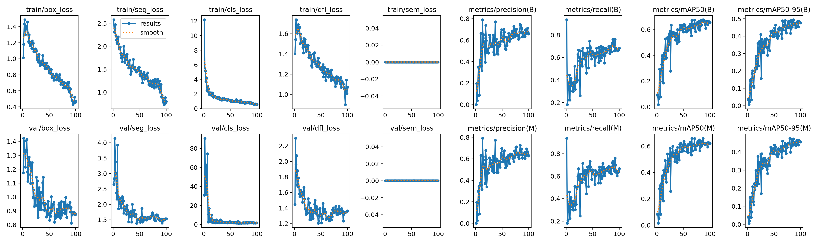
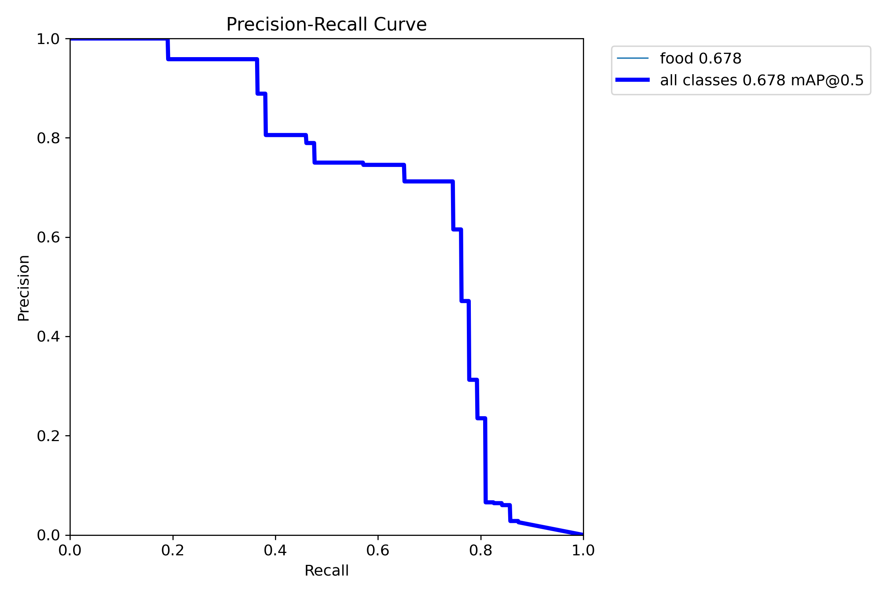
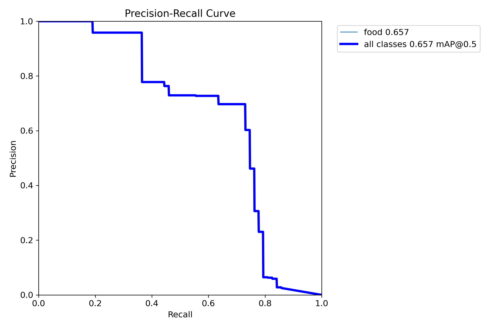
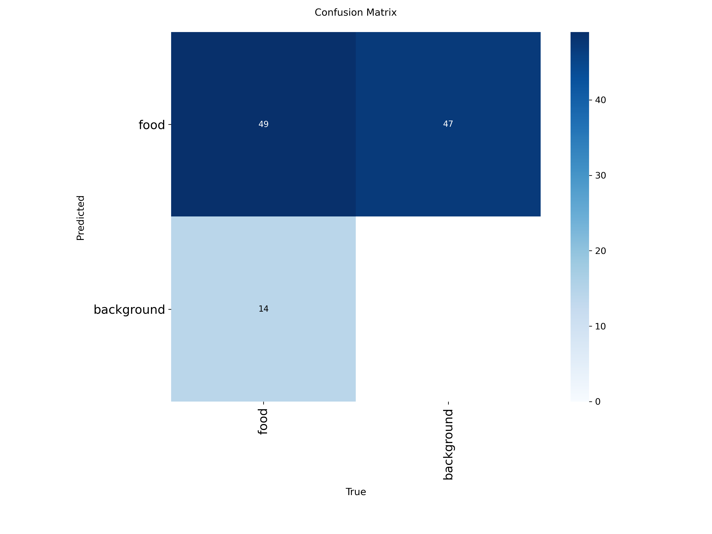
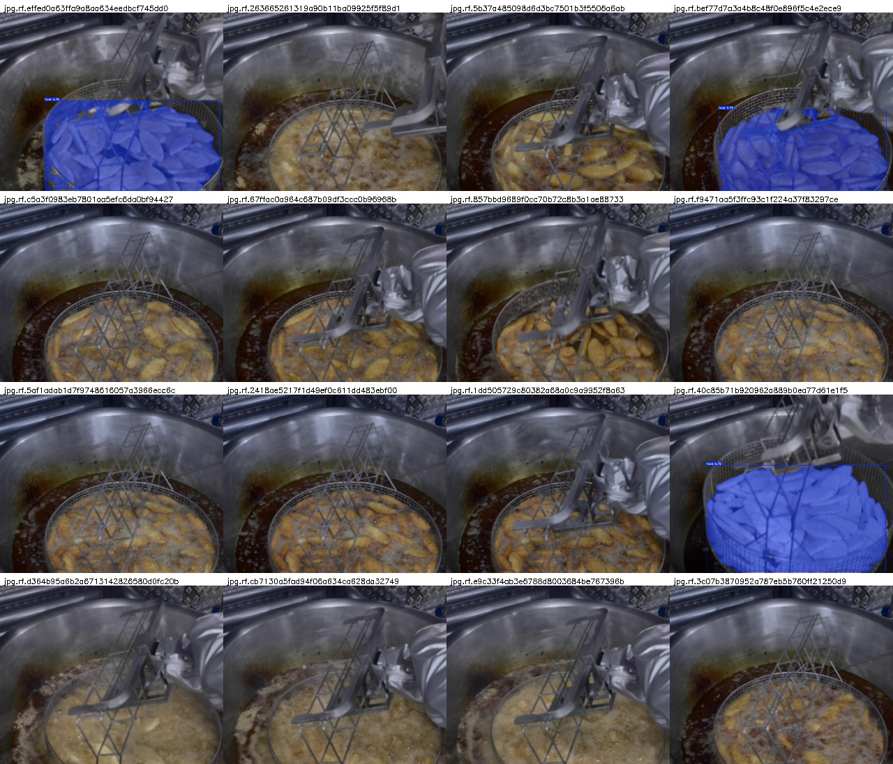

# YOLOv8 Segmentation 모델 보고서

## 튀김 영역 검출을 위한 Instance Segmentation 모델

**최종 모델 버전**: v3
**작성일**: 2026년 2월 2일
**모델 파일**: `runs/segment/frying_seg_v3_20260202_110544/weights/best.pt`

---

## 1. 개요

### 1.1 목적
급식 주방에서 튀김 조리 과정을 모니터링하기 위해, 카메라 영상에서 튀김 영역을 정확하게 검출하고 분할(segmentation)하는 딥러닝 모델을 개발하였다. 검출된 튀김 영역의 색상 변화를 분석하여 조리 완료 시점을 판단하는 데 활용된다.

### 1.2 모델 선택 근거
| 항목 | 선택 | 근거 |
|------|------|------|
| **아키텍처** | YOLOv8-seg | 실시간 추론 가능, SOTA 성능 |
| **모델 크기** | nano (n) | Jetson 디바이스 배포 고려, 경량화 |
| **태스크** | Instance Segmentation | 튀김 영역의 정확한 픽셀 단위 마스크 필요 |

---

## 2. 데이터셋

### 2.1 데이터셋 정보
| 항목 | 값 |
|------|-----|
| **데이터셋명** | DKU_HDEV_FRY_FOOD.v3i.yolov8 |
| **출처** | Roboflow (레이블링 도구) |
| **이미지 해상도** | 800 x 640 pixels |
| **클래스 수** | 1 (food) |
| **라이센스** | CC BY 4.0 |

### 2.2 데이터 분할
| 세트 | 이미지 수 | 비율 |
|------|----------|------|
| **Train** | 708 | 62.7% |
| **Validation** | 215 | 19.0% |
| **Test** | 206 | 18.3% |
| **Total** | 1,129 | 100% |

### 2.3 어노테이션 형식
- **형식**: YOLOv8 Segmentation (polygon coordinates)
- **좌표계**: Normalized (0~1)
- **파일 구조**: 이미지당 1개의 txt 파일 (class_id + polygon points)

---

## 3. 모델 아키텍처

### 3.1 YOLOv8n-seg 구조
```
┌─────────────────────────────────────────────────┐
│                   Backbone                       │
│              (CSPDarknet + C2f)                  │
├─────────────────────────────────────────────────┤
│                     Neck                         │
│                (PANet + FPN)                     │
├─────────────────────────────────────────────────┤
│                    Head                          │
│         Detection + Segmentation                 │
│     ┌─────────────┐  ┌─────────────────┐        │
│     │  Box Head   │  │  Proto + Mask   │        │
│     │ (cls + reg) │  │     Coeffs      │        │
│     └─────────────┘  └─────────────────┘        │
└─────────────────────────────────────────────────┘
```

### 3.2 모델 사양
| 항목 | 값 |
|------|-----|
| **파라미터 수** | 3,258,259 (3.3M) |
| **GFLOPs** | 11.3 |
| **레이어 수** | 86 (fused) |
| **모델 파일 크기** | 6.8 MB |

---

## 4. 학습 설정

### 4.1 하드웨어 환경
| 항목 | 사양 |
|------|------|
| **GPU** | NVIDIA GeForce RTX 5070 Ti |
| **VRAM** | 16 GB |
| **Framework** | PyTorch 2.9.1 + CUDA 12.8 |
| **Ultralytics** | 8.4.9 |

### 4.2 학습 하이퍼파라미터
| 파라미터 | 값 | 설명 |
|----------|-----|------|
| **epochs** | 100 | 최대 학습 에폭 |
| **batch** | 16 | 배치 크기 |
| **imgsz** | 800 | 입력 이미지 크기 |
| **optimizer** | AdamW (auto) | 옵티마이저 |
| **lr0** | 0.01 | 초기 학습률 |
| **lrf** | 0.01 | 최종 학습률 비율 |
| **momentum** | 0.937 | SGD 모멘텀 |
| **weight_decay** | 0.0005 | L2 정규화 |
| **warmup_epochs** | 3.0 | 웜업 에폭 |
| **patience** | 20 | Early stopping patience |

### 4.3 데이터 증강 (Augmentation)
| 증강 기법 | 값 | 설명 |
|----------|-----|------|
| **mosaic** | 1.0 | 4개 이미지 합성 |
| **hsv_h** | 0.015 | 색조 변화 |
| **hsv_s** | 0.7 | 채도 변화 |
| **hsv_v** | 0.4 | 명도 변화 |
| **fliplr** | 0.5 | 좌우 반전 확률 |
| **scale** | 0.5 | 스케일 변화 |
| **translate** | 0.1 | 이동 변화 |
| **erasing** | 0.4 | Random erasing |
| **auto_augment** | randaugment | 자동 증강 정책 |

### 4.4 손실 함수 가중치
| 손실 | 가중치 | 설명 |
|------|--------|------|
| **box** | 7.5 | Bounding box 손실 |
| **cls** | 0.5 | 분류 손실 |
| **dfl** | 1.5 | Distribution focal loss |

---

## 5. 학습 결과

### 5.1 최종 성능 (Best Model)
| 메트릭 | Box Detection | Mask Segmentation |
|--------|---------------|-------------------|
| **Precision** | 0.708 | 0.693 |
| **Recall** | 0.730 | 0.716 |
| **mAP@50** | 0.678 | 0.657 |
| **mAP@50-95** | 0.495 | 0.473 |

### 5.2 추론 속도 (RTX 5070 Ti 기준)
| 단계 | 시간 |
|------|------|
| **Preprocess** | 0.1 ms |
| **Inference** | 1.0 ms |
| **Postprocess** | 2.3 ms |
| **Total** | ~3.4 ms |
| **FPS** | ~294 FPS |

### 5.3 학습 곡선


*위 그래프는 100 에폭 동안의 학습 손실 및 검증 메트릭 변화를 보여준다.*

### 5.4 Precision-Recall 곡선
#### Box Detection


#### Mask Segmentation


### 5.5 Confusion Matrix


### 5.6 예측 결과 시각화


*Validation 데이터셋에 대한 모델 예측 결과 (16개 샘플)*

---

## 6. 버전별 성능 비교

### 6.1 데이터셋 버전 비교
| 버전 | 해상도 | 데이터 수 | 특징 |
|------|--------|----------|------|
| v2 | 640×640 | 708/215/206 | 정사각형 |
| **v3** | **800×640** | **708/215/206** | **직사각형 (최종)** |

### 6.2 모델 크기 비교 (v2 데이터셋 기준)
| 모델 | 파라미터 | Box mAP@50 | Mask mAP@50 | 추론 속도 |
|------|----------|------------|-------------|-----------|
| **nano (n)** | 3.3M | 0.595 | 0.585 | 0.8ms |
| medium (m) | 27.2M | 0.593 | 0.547 | 3.8ms |

**결론**: nano 모델이 더 효율적 (더 빠르고 비슷한 성능)

### 6.3 해상도별 성능 비교 (nano 모델 기준)
| 버전 | 해상도 | Box mAP@50 | Mask mAP@50 | 추론 속도 | 향상 |
|------|--------|------------|-------------|-----------|------|
| v2 | 640×640 | 0.595 | 0.585 | 0.8ms | - |
| **v3** | **800×640** | **0.678** | **0.657** | **1.0ms** | **+8.3%p / +7.2%p** |

**결론**: 800×640 해상도가 성능 향상에 크게 기여 (+8%p 이상)

---

## 7. 모델 사용법

### 7.1 추론 코드
```python
from ultralytics import YOLO
import cv2
import numpy as np

# 모델 로드
model = YOLO('runs/segment/frying_seg_v3_20260202_110544/weights/best.pt')

# 이미지 추론
results = model.predict('image.jpg', conf=0.5)

# 마스크 추출
if results[0].masks is not None:
    # 이진 마스크 (H, W)
    mask = results[0].masks.data[0].cpu().numpy()

    # 원본 이미지 크기로 리사이즈
    mask_resized = cv2.resize(mask, (original_width, original_height))

    # 마스크 영역에서 색상 추출
    img = cv2.imread('image.jpg')
    hsv = cv2.cvtColor(img, cv2.COLOR_BGR2HSV)

    # 튀김 영역의 평균 HSV 색상
    food_pixels = hsv[mask_resized > 0.5]
    mean_h = food_pixels[:, 0].mean()
    mean_s = food_pixels[:, 1].mean()
    mean_v = food_pixels[:, 2].mean()

    print(f"튀김 영역 평균 HSV: H={mean_h:.1f}, S={mean_s:.1f}, V={mean_v:.1f}")
```

### 7.2 Jetson 배포 시 고려사항
- **TensorRT 변환**: 추가 최적화로 2~3배 속도 향상 가능
- **FP16 모드**: 메모리 절약 및 속도 향상
- **배치 처리**: 여러 프레임 동시 처리 시 효율 증가

---

## 8. 결론 및 향후 과제

### 8.1 결론
- YOLOv8n-seg 모델을 사용하여 튀김 영역을 실시간으로 검출 및 분할 가능
- 800×640 해상도에서 mAP@50 67.8% (Box), 65.7% (Mask) 달성
- 추론 속도 약 1ms로 실시간 처리 가능 (Jetson에서도 충분한 성능 예상)
- nano 모델이 medium 모델보다 효율적 (경량화 + 유사 성능)

### 8.2 향후 과제
1. **데이터 확장**: 다양한 튀김 종류 및 조리 단계 이미지 추가
2. **TensorRT 최적화**: Jetson 배포를 위한 모델 변환
3. **색상 분석 통합**: segmentation 결과와 색상 측정 파이프라인 연동
4. **실시간 테스트**: 실제 주방 환경에서 성능 검증

---

## 9. 참고 자료

### 9.1 파일 경로
| 파일 | 경로 |
|------|------|
| 모델 가중치 | `runs/segment/frying_seg_v3_20260202_110544/weights/best.pt` |
| 학습 설정 | `runs/segment/frying_seg_v3_20260202_110544/args.yaml` |
| 학습 로그 | `runs/segment/frying_seg_v3_20260202_110544/results.csv` |
| 학습 스크립트 | `scripts/train_yolov8_seg_v3.py` |

### 9.2 라이브러리 버전
| 라이브러리 | 버전 |
|------------|------|
| Python | 3.12.3 |
| PyTorch | 2.9.1+cu128 |
| Ultralytics | 8.4.9 |
| CUDA | 12.8 |

---

*본 보고서는 DKU 튀김 조리 완료 판단 AI 프로젝트의 일환으로 작성되었습니다.*
